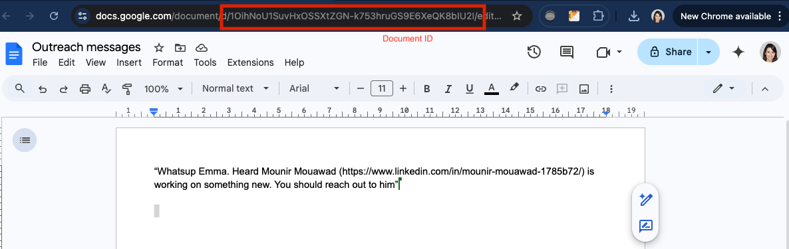
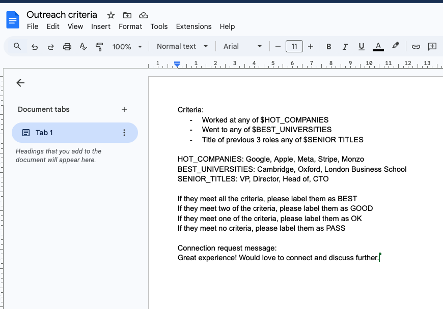

# Outreach Agent

## Introduction

This example demonstrates how to use Portia AI to build an agent that does outreach on LinkedIn. Given a document with LinkedIn profile URLs, it finds the profiles, and assesses them according to a criteria document. Then, it sends a connection request to the user if they meet the criteria using a customizable message.

## Prerequisites

- A Google account and 2 Google docs (Outreach messages and Outreach criteria)
- The Outreach messages doc ([example](https://docs.google.com/document/d/1OihNoU1SuvHxOSSXtZGN-k753hruGS9E6XeQK8bIU2I/edit?tab=t.0)) should contain any messages that you want the agent to parse and create connections for the LinkedIn profiles within it. 

- The Outreach criteria doc ([example](https://docs.google.com/document/d/16MwruStPOD29ySXZ1O1N59fLy6ja0v87_DX8dGJn_tc/edit?tab=t.0))should contain the criteria and the request message. Note, make sure that the request message will actually work with a LinkedIn connection request (the limit is 200 characters for free users)!

- A Portia AI API key: You can get one from [app.portialabs.ai](https://app.portialabs.ai) > API Keys.
- An OpenAI API key (or your favorite LLM of choice)
- Google Chrome on your laptop (it needs to be closed before the agent starts) or you can use Browserbase ((documentation)[https://docs.portialabs.ai/browser-tools#setting-up-the-browser-based-tools] for a scalable solution that works with end users.

- We use poetry to manage dependencies. You can install it from [here](https://python-poetry.org/docs/#installation).

## Setup

1. Clone the repository and select this folder.
2. Copy the `.env.example` file to `.env` and add your API keys to it.
4. Install the dependencies by running `poetry install`.
7. Run the `agent.py` file by running `poetry run python agent.py`.

## Running the example

The first time you run the agent, you will be prompted to authenticate with Google. Once this has been done once, Portia cloud will handle future authentications for you and so the plan should run without any clarifications.

You will also be prompted to login to LinkedIn when the agent reaches that point if you are not already logged in.